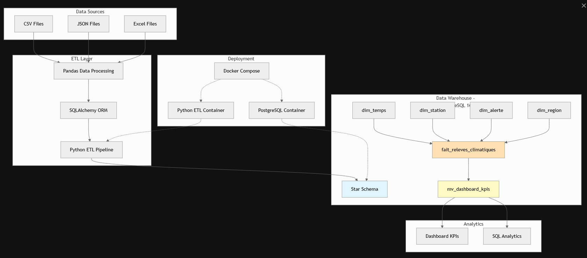

# 🌾 PROJET BI - AGRICULTURE RÉSILIENCE 2030

## 📋 Description
Preuve de Concept (PoC) d'une plateforme décisionnelle pour le Ministère de l'Agriculture et du Développement Durable du Maroc.

## 🎯 KPIs Prioritaires
| KPI | Nom | Description | Seuils d’alerte |
|-----|-----|-------------|----------------|
| KPI 1 | IDHC (Indice Déficit Hydrique Cumulé) | Indice cumulé du déficit hydrique sur 30 jours | Normal : < 50, Modéré : 50–100, Critique : > 100 |
| KPI 2 | Température maximale | Suivi de la température maximale quotidienne | Normal : < 40°C, Alerte : 40–45°C, Extrême : > 45°C |
| KPI 3 | Jours consécutifs sans pluie | Nombre de jours consécutifs sans précipitations | Normal : < 10, Sécheresse modérée : 10–20, Sévère : > 20 |
| KPI 4 | Fréquence des alertes météo | Fréquence des alertes météorologiques | Niveaux de gravité : VERT, JAUNE, ORANGE, ROUGE |
| KPI 5 | Score de risque composite | Score de risque combiné (0–100) | Faible : < 25, Modéré : 25–50, Élevé : 50–75, Critique : > 75 |

## Architecture du projet
La plateforme met en œuvre une architecture d'entrepôt de données utilisant un schéma en étoile optimisé pour les requêtes analytiques. Le système suit un modèle d'architecture BI classique : sources de données → pipeline ETL → entrepôt de données → tableau de bord analytique.


## 🚀 Installation Rapide

### Prérequis
| Exigence | Version minimale | Description | Objectif |
|---------|------------------|-------------|----------|
| Docker Desktop | Dernière version | Plateforme d’orchestration de conteneurs | Exécute PostgreSQL 16 et les services ETL Python |
| RAM | 4 Go | Mémoire système | Prend en charge les opérations de base de données et le traitement Python |
| Espace disque | 2 Go | Stockage disponible | Stocke les données PostgreSQL, les images Docker et les données générées |
| Système d’exploitation | Windows / Linux / macOS | Tout OS compatible avec Docker | Compatibilité multiplateforme |


## Étapes d’installation

Suivez ce processus étape par étape pour lancer la plateforme complète.
La configuration automatisée utilise **Docker Compose** pour gérer toutes les dépendances des services et leur orchestration.

---

### Étape 1 : Accéder au répertoire de la base de données

Commencez par vous placer dans le répertoire de la base de données où se trouve la configuration **docker-compose**.
Ce dossier contient tous les fichiers d’orchestration nécessaires pour lancer à la fois **PostgreSQL** et les services **ETL Python**.

```bash
cd database
```
### Étape 2 : Lancer les services Docker

Exécutez Docker Compose pour initialiser les deux conteneurs.
Le service postgres exécutera automatiquement le script init.sql au démarrage, créant l’entrepôt de données complet incluant les dimensions, les tables de faits et les vues matérialisées optimisées pour les 5 KPI prioritaires.

```bash
docker-compose up -d
```


Le service postgres est configuré avec des vérifications d’état (health checks) qui attendent automatiquement que la base de données soit totalement opérationnelle avant que les services dépendants ne s’y connectent.

### Étape 3 : Attendre l’initialisation de la base de données

Patientez environ 10 secondes pour que PostgreSQL termine son initialisation.
La base de données exécutera automatiquement `init.sql`, qui crée le schéma en étoile comprenant :

- **Dimensions** : dim_temps, dim_station, dim_region, dim_alerte
- **Table de faits** : fait_releves_climatiques
- **KPI pré-calculés**

### Étape 4 : Exécuter le pipeline ETL

Une fois la base de données prête, lancez le pipeline ETL pour alimenter l’entrepôt de données avec des données d’exemple.
Le conteneur Python se connecte à PostgreSQL via le réseau interne Docker et traite les fichiers de génération de données.
```bash
docker exec python_etl python /etl/etl_pipeline.py
```


Le pipeline ETL utilise SQLAlchemy avec pandas pour :

- Charger efficacement les données
- Prétraiter les relevés météorologiques
- Calculer des KPI complexes (dont l’IDHC et les scores de risque composites)
- Alimenter les tables de dimensions et de faits
- Effectuer automatiquement le nettoyage, la transformation et la validation de la qualité des données


### Étape 5 : Vérifier l’installation

Confirmez le chargement réussi des données en interrogeant la vue matérialisée du tableau de bord.
Cette vue agrège tous les KPI et fournit un accès instantané aux indicateurs de surveillance.

```bash
docker exec agriculture_dw psql -U bi_user -d agriculture_dw -c "
SELECT COUNT(*) FROM mv_dashboard_kpis;
SELECT date_complete, nom_station, temperature_max, score_risque, categorie_risque
FROM mv_dashboard_kpis
ORDER BY date_complete DESC, nom_station
LIMIT 10;"
```


- La première requête doit renvoyer un nombre non nul, indiquant que les données sont bien présentes.
- La seconde affiche les relevés les plus récents avec les catégories de risque calculées pour toutes les stations de surveillance.